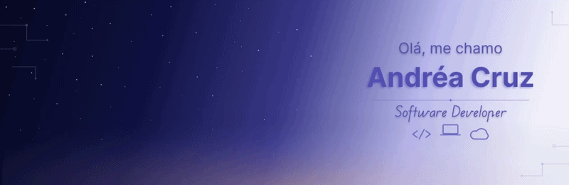

Desenvolvedora de Software em formação, criando soluções que unem tecnologia, resolução de problemas e experiência do usuário. Atualmente aprendendo através de projetos práticos com C#, SQL, HTML, CSS e JavaScript enquanto construo minha carreira na área de tecnologia.

## 🧠 Linguagens e Tecnologias

  

 

## 📊 Estatísticas

<table align="center">
  <tr>
    <td>
      
    </td>
    <td>
      
    </td>
  </tr>
</table>

 

## Atualmente estudando
* Lógica de programação
* Desenvolvimento Web
* Banco de Dados

## Objetivos Atuais
- Consolidar minha base em lógica de programação e desenvolvimento de software.
- Construir projetos práticos utilizando C#, SQL e tecnologias Web.
- Aprender boas práticas de desenvolvimento.
- Evoluir continuamente para atuar como Desenvolvedora de Software.
- Contribuir para projetos que gerem impacto positivo para usuários.
